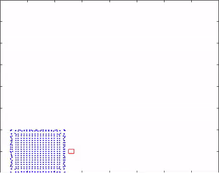

A smoothed particle hydrodynamics simulation for two scenarios:

1. A sheet of fluid flowing past a fixed object
2. A sheet of fluid under the influence of gravity falling into a bucket

## Demos

A sheet of water being dropped into a bucket

Water flowing past a solid object

